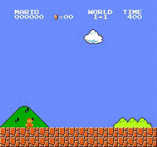

# VL_RL

**Vision-Language agents for Reinforcement Learning environments.**

VL_RL is a lightweight framework that turns any RL environment into a world playable by LLMs/VLMs. Connects any Gym/Gymnasium env with any LLM.

**DEMO:** Qwen 3.6 35B-A3B plays `SuperMarioBros-v0`

---

## Installation

From PyPI:

    pip install vl-rl

From GitHub:

    pip install git+https://github.com/Vxtzq/VL-RL.git

Local development:

    git clone https://github.com/Vxtzq/VL-RL.git
    cd VL-RL
    pip install -e .

With vLLM support:

    pip install "vl-rl[vllm]"

---

## Quick Start

    from PIL import Image
    from vl_rl.env import LLM_env
    from vl_rl.agent import ollama_agent, reset_ollama_history

    # 1. Wrap your env
    env, prompt = LLM_env(
        env=my_gym_env,
        description="Complete the level as fast as possible.",
        action_description="0=NOOP, 1=right, 2=jump, 3=run, 4=run+jump",
        output_format="boxed"
    )

    # 2. Run the agent
    obs = Image.fromarray(state)
    action, explanation = ollama_agent(obs=obs, prompt=prompt, model_name="qwen3-vl:8b")
    print(f"Action: {action} | {explanation}")

---

## Full Example: Super Mario Bros

    import time
    from PIL import Image
    from nes_py.wrappers import JoypadSpace
    import gym_super_mario_bros
    from gym_super_mario_bros.actions import COMPLEX_MOVEMENT

    from vl_rl.env import LLM_env
    from vl_rl.agent import ollama_agent, reset_ollama_history

    FRAME_SKIP = 4

    act_space_desc = """
    0 - ['NOOP'], 1 - ['right'], 2 - ['right', 'A'], 3 - ['right', 'B'],
    4 - ['right', 'A', 'B'], 5 - ['A'], 6 - ['left'], 7 - ['left', 'A'],
    8 - ['left', 'B'], 9 - ['left', 'A', 'B'],
    10 - ['down'] (FORBIDDEN), 11 - ['up'] (FORBIDDEN)
    - A = jump (hold to jump higher)
    - B = run (hold while jumping = higher jump, useful for pipes)"""

    goal = "Complete World 1-1 as fast as possible without dying."

    mario_rules = """
    # GAME-SPECIFIC RULES
    - Brown mushrooms with feet = GOOMBAS (enemies, MUST jump over)
    - Red/white spotted mushrooms = POWER-UPS (GOOD, collect them)
    - Green pipes = solid walls (jump over with Action 4, NEVER try to enter)
    - Green hills/bushes = BACKGROUND decoration, NOT obstacles
    - Gaps/pits = instant death (MUST jump)
    - ? blocks = hit from below to get items
    - The FLAGPOLE at the end is the goal, NOT the pipes
    - Running (Action 3) is optimal on flat ground with no enemies
    - You MUST jump (Action 2 or 4) when a Goomba, pipe, or gap is ahead

    # STRATEGY
    - Run right (Action 3) when path is clear
    - Jump (Action 2/4) over enemies and pipes
    - Do NOT just run right blindly — look at the screen first
    """

    env = gym_super_mario_bros.make('SuperMarioBros-v0')
    env = JoypadSpace(env, COMPLEX_MOVEMENT)
    env, prompt = LLM_env(env, goal, act_space_desc, output_format="boxed")
    full_prompt = prompt + mario_rules

    done = True
    info = {}
    total_time = 0
    step_times = []

    for step in range(1000):
        if done:
            state = env.reset()
            reset_ollama_history()

        obs = Image.fromarray(state)
        print(f"\n--- Step {step} ---")

        t0 = time.time()
        act, explain = ollama_agent(obs=obs, prompt=full_prompt)
        elapsed = time.time() - t0

        step_times.append(elapsed)
        total_time += elapsed
        avg_time = total_time / len(step_times)

        print(f"⏱️  {elapsed:.1f}s (avg: {avg_time:.1f}s) | Action: {act} | {explain[:80]}")

        for i in range(FRAME_SKIP):
            state, reward, done, info = env.step(act)
            if done:
                break

        env.render()
        if done:
            print("==== Agent died ====")
            print(f"📊 {len(step_times)} steps, {total_time:.1f}s total, {avg_time:.1f}s/step")

    if step_times:
        print(f"\n📊 FINAL: {len(step_times)} steps | {total_time:.1f}s ({total_time/60:.1f} min)")
        print(f"   Avg: {avg_time:.1f}s | Min: {min(step_times):.1f}s | Max: {max(step_times):.1f}s")

    env.close()

---

## Backends

| Backend | Auto-download | Thinking | Setup |
|---------|--------------|----------|-------|
| **Ollama** | ✅ Yes | ✅ Native  | `ollama serve` |
| **vLLM** | ❌ Manual |   | `init_vllm()` |

---

## How It Works

1. **LLM_env** wraps any Gym env with a structured prompt (goal + action space + output format)
2. **ollama_agent / vllm_agent** sends the current frame + prompt to the VLM
3. The VLM reasons about the scene and outputs an action in `\boxed{N}` format
4. The action is executed in the env, and the loop repeats

---

## License

MIT
